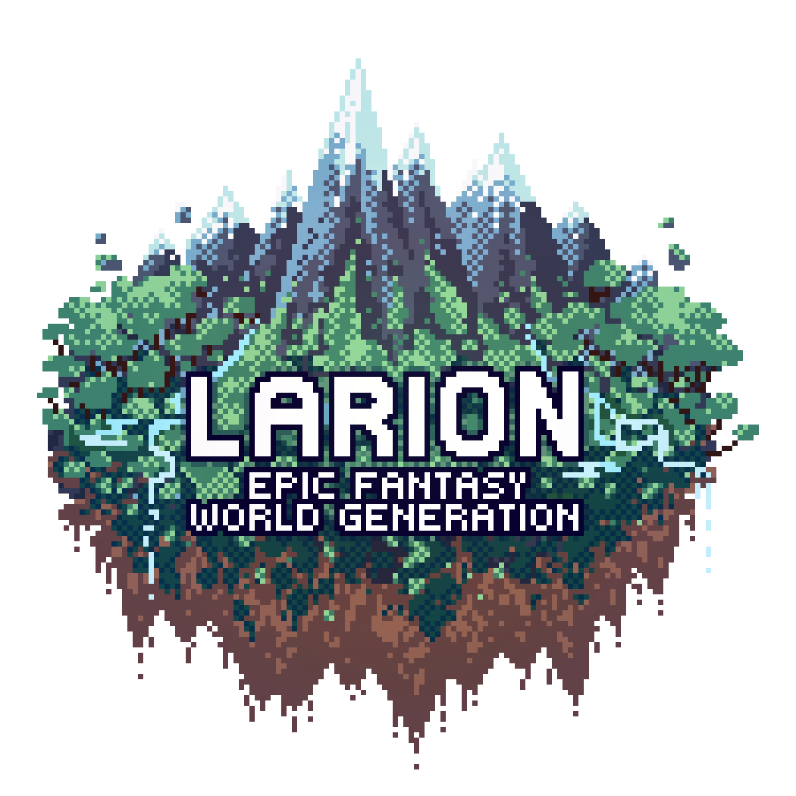

# Larion World Generation, for Minecraft 1.20-1.21.1

Larion is a terrain generation mod that overhauls the style and layout of world generation in a modern-vanilla-like "epic fantasy" style favoring otherworldly, dreamlike vistas.

Larion alters the **shape of the terrain**, **cave generation** and the **layout of biomes**, but makes no changes to the actual biomes or their features, allowing you to pair it with any compatible biome-altering mods or just keep it close to vanilla as the screenshots show.

Please be aware that the mod is still in active development, future updates will (almost) always change how the world is generated and break continuity with previously generated terrain. I would suggest not updating the mod on existing worlds unless your are okay with weird chunk borders.

If you want a limited world size, check out the [Disc
World](https://modrinth.com/datapack/larion-one-continent) add-on datapack!

## Features

- Adjusted world height, now goes from -128 to 512.
- Oceans are actual infinite oceans with landmasses of varying size. If your
spawn point on a new world is just islands, you're likely just far away from any large landmasses.
- Temperature zones are laid out vertically in bands, instead of being random blobs
- Terrain erosion (a parameter that decides between mountains, hills, flatland and windswept/swamps) is laid out very differently and can lead to unique landshapes.
- Rivers are long, meandering and form deep valleys in mountain areas. In rare cases they will tunnel straight though terrain.
- The shape of terrain is very different on the small scale too, using a special domain wrap technique to deform the horizontal axes only, replacing the janky 3d noise of vanilla. This makes cliffs way more cool looking.
- Steep hills will have exposed stone surfaces in all biomes. Somewhat steep hills get a nice gradient of stone and normal surface.

## Recommended mods/datapacks

I heavily recommend playing with [Distant Horizons](https://modrinth.com/mod/distanthorizons) and pre-generating your world to allow the scale of the terrain to strike awe from the get-go.

I also recommend using [William Wyther's Overhauled Overworld](https://modrinth.com/datapack/william-wythers-overhauled-overworld-(datapack)) as a complimentary worldgen datapack as it is frankly a work of art and its visual style fits Larion perfectly. Be sure to use the datapack version, if you use WWOO as a mod you may run into issues with load order. If you find that mountains are "chopped off" at around Y=320, open the WWOO .zip archive in for example 7zip and delete the files at these locations:
- `1-20-5-overlay/data/minecraft/dimension_type/overworld.json`
- `1-21-overlay/data/minecraft/dimension_type/overworld.json`
- `data/minecraft/dimension_type/overworld.json`

Some seeds will spawn you in water or on a tiny island in the middle of
nowhere. If you want a bit more predictability when creating a world, I would
recommend using [World Preview](https://modrinth.com/mod/world-preview).

Finally, you should stock up on worldgen optimization mods, as Larion tends to slow it down a lot due to the added complexity. Here are a few:
- [C2ME](https://modrinth.com/mod/c2me-fabric) (Biggest performance boost, but can be unstable)
- [Noisium](https://modrinth.com/mod/noisium)
- [Faster Random](https://modrinth.com/mod/faster-random)
- [FerriteCore](https://modrinth.com/mod/ferrite-core)

## Compability notes with other worldgen datapacks/mods

As a rule of thumb, if mods or datapacks modify Minecraft's **density functions** (in worldgen/density_functions), there will be compability issues with Larion and your worlds will probably look weird in one way or the other. Basically any mod that alters terrain shape or caves, for example Terralith, Tectonic, Litosphere, Big Globe, Expanded Echosphere and Cascades.

However, mods and datapacks that only alter biome features and/or add new biomes should be fully compatible. A few examples are Arboria, WWOO and Geophilic.

# Thanks to

- alkexr, creator of
[Eldor](https://www.planetminecraft.com/data-pack/eldor/). Eldor was a major
insipration for this pack and I used many of its clever density functions as a reference.
for several changes.
- jacobsjo, creator of [Saddle Valley Rivers](https://www.planetminecraft.com/data-pack/saddle-valley-rivers-canyons-and-underground-rivers-1-18-2-only/)
- devpelux, creator of [X-Mountains](https://modrinth.com/datapack/xmountains)
- Apollo, creator of [Deeper oceans](https://modrinth.com/datapack/deeper-oceans) and [Tectonic](https://modrinth.com/datapack/tectonic)
- Klinbee, creator of [More Density Functions](https://modrinth.com/mod/more-density-functions)

# Footnotes

All pictures in this readme and on the modrinth page were taken using the
[Distant Horizons](https://modrinth.com/mod/distanthorizons) mod to see very far.

Larion is licensed under Apache 2.0, meaning you are free to modify and use the
pack as you wish. You can freely use any individual parts in your own
mod or datapack. However, if you choose to redistribute Larion, please be sure to
include the copyright (LICENSE.md) file, a link to this page and also state any
significant changes made.

If you like the project and want to send me a personal donation, here is a Paypal link:

https://www.paypal.com/donate/?hosted_button_id=L2WKHTDJ4DANU

.. or alternatively send some Bitcoin to bc1qk5688pjsy228zkrda5e9w43wzn0zye4w0ygej4
