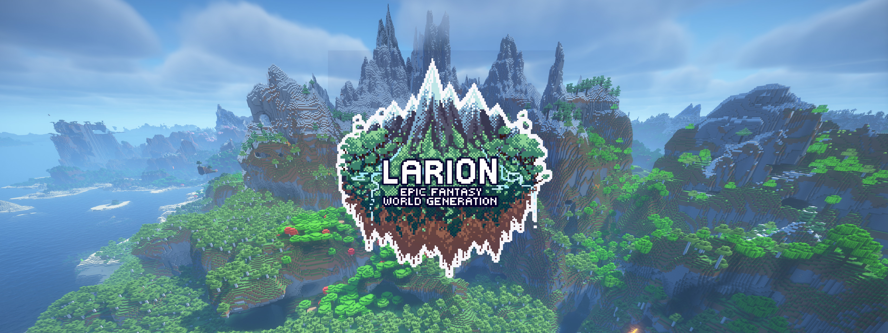

# Larion - Epic Fantasy World Generation for Minecraft 1.19.2-1.20.6

Do you like mountains?

Do you like REALLY TALL mountains?

Do you like terrain so hilly and full of cliffs, basic navigation becomes a
major challenge?

Do you also like sailing the high seas? Exploring far-off islands? Huge inland
valleys? Massive deserts? Long, winding river tunnels? Floating mushroom islands!?!

Then this mod/datapack was practically made for you!

Larion is a major revamp of the overworld generation in Minecraft that aims to
be a blend of **Epic fantasy** (think World of Warcraft, Lord of the Rings,
realism is not a priority here, cool factor is!) and **Minecraftness** (The
janky, hilly, blobby terrain Minecraft is known for that was most prominent in
Alpha and Beta versions).

To accomplish this, Larion makes several major changes to how biomes are
distributed, along with some extra terrain features described below.

## How to install

Larion **requires** the [More Density
Functions](https://modrinth.com/mod/more-density-functions) Fabric mod in order
to function, as several important features make use of the "sine" and "x"
functions added by this mod. (If anyone from Mojang reads this, please add these
functions to the core game! It would be great to be able to distribute Larion
as a pure vanilla data pack.)

- Download **Version 1.0.4** of [More Density Functions](https://modrinth.com/mod/more-density-functions) and move it to your `.minecraft/mods/` folder - make sure to pick the one that matches the version of Minecraft you are using. 
- Download `Larion-xxxx-mcxxxx.jar` and move it to your `.minecraft/mods/` folder.
    - Alternatively, you can download `Larion-xxxx-mcxxxx.zip` and add it
    directly to your world as a datapack, but More Density Functions is still
    required for it to work.

# Features

## Huge continents and little islands

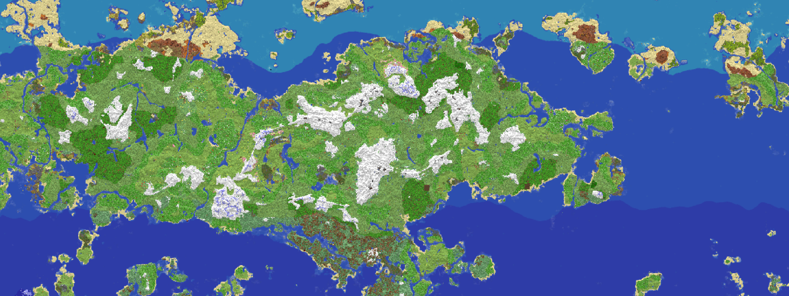

Instead of an infinite mainland with small scattered "oceans" (more like big
lakes), the overworld now consists of differently sized continents with many
smaller islands between them. I felt like other world generation datapacks
usually made continents way too big, so in Larion they are scaled down quite a
bit so that they are easier to explore fully, but still large enough to feel vast. The continent pictured above is approximately 8500x2800 blocks in size.

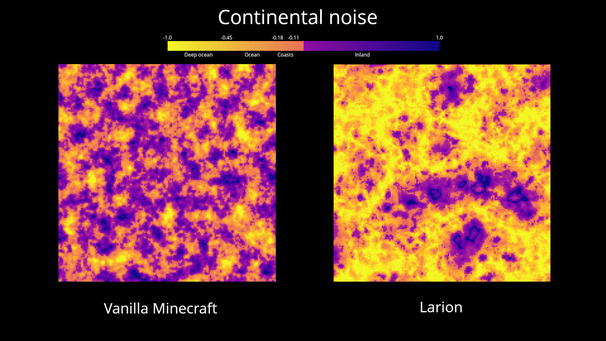

## Taller everything

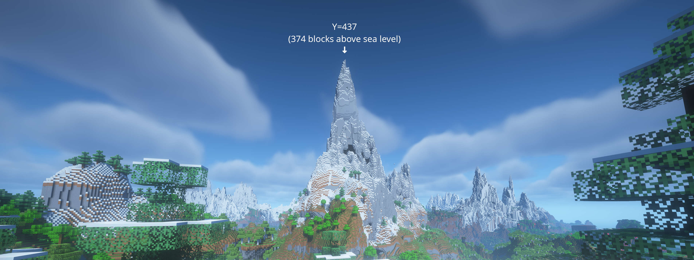

The world height has been raised from 384 to 512, meaning the world now
stretches from Y=-64 to Y=448. The scale of the terrain has been extended as
well, meaning pretty much every hill is taller than it usually would be, but
stupidly tall mountains are of couse the key feature of this change.

## The Jank Factor

There's not much interesting about a world with only smooth, easy-to-climb
slopes. It may look "realistic" but where's the fun in that??

This is why I added an entirely new layer of what I call "jank" or
"minecraftness" to the terrain. It works similarily to the existing "windswept" effect. It tapers off at rivers, beaches, oceans and deserts, but other than that, every surface has been affected. This added noise creates more hills, more overhangs, floating islands and other strange phenomenon.

## Temperature bands

I felt like the temperature zones in Minecraft could use some extra size, but
also a bit of predictability. To solve this, the temperature noise map has been
replaced with what I call "temperature bands", meaning it gets colder as you go
north and warmer as you go south. If you live on the southern hemisphere and
feel offended by this, simply set your spawn point far enough to the south, as
the bands warps back around like this picture shows:

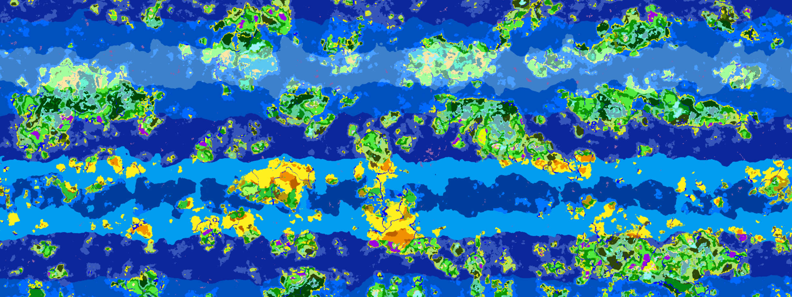

You may have noticed that desert-y and jungle-y biomes have been swapped
compared to vanilla, as I felt this was somewhat more appropriate and
Earth-like - of course the Earth's biome distribution is way more complex - but deserts
usually appear in subtropical latitudes (Sahara, Australia) while jungles and
such appear at the equator (Central Africa, South America).

## Coastal swamps and inland mountains

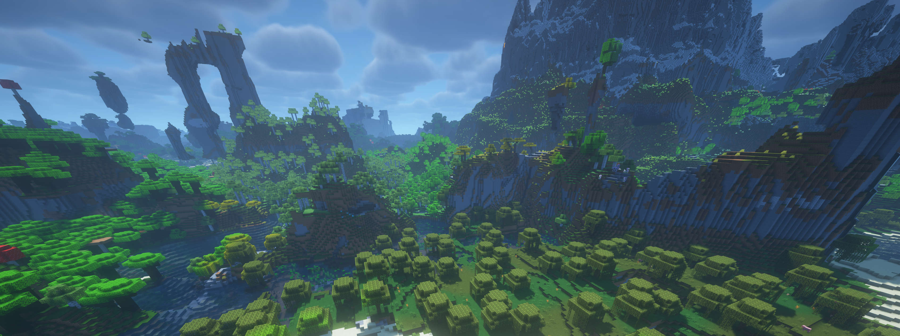

The "erosion" noise, determining if an area has "low erosion" (mountains) or
"high erosion" (swamps, but also all windswept biomes), has been explicitly tied
to the continents noise so that erosion will "lower" as you go further
inland. The result is that continents usually have swamps and windswept biomes
at the edges, normal biomes further in and mountains at the center.

In some cases, continents would become TOO mountainous (even I have
limits), so I made the erosion and continentalness taper off after a certain
point, creating large valleys in the middle of some continents.

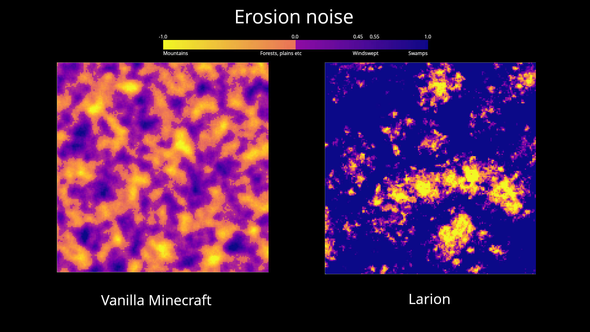

## Rivers and ridges

The "ridge" noise, also called weirdness, is what creates rivers, hills,
mountain peaks and even "weird" biome variants. As you can imagine, it's one of
the more complex noise functions in the game.

Larion uses the same "ridge" noise as the
[Eldor](https://www.planetminecraft.com/data-pack/eldor/) datapack, tweaked only
slightly to make rivers a bit wider and longer. alkexr did such a fantastic job
creating his ridge noise I could hardly imagine doing it any better, and the rivers and peaks it generates fit perfectly within the
Larion world.

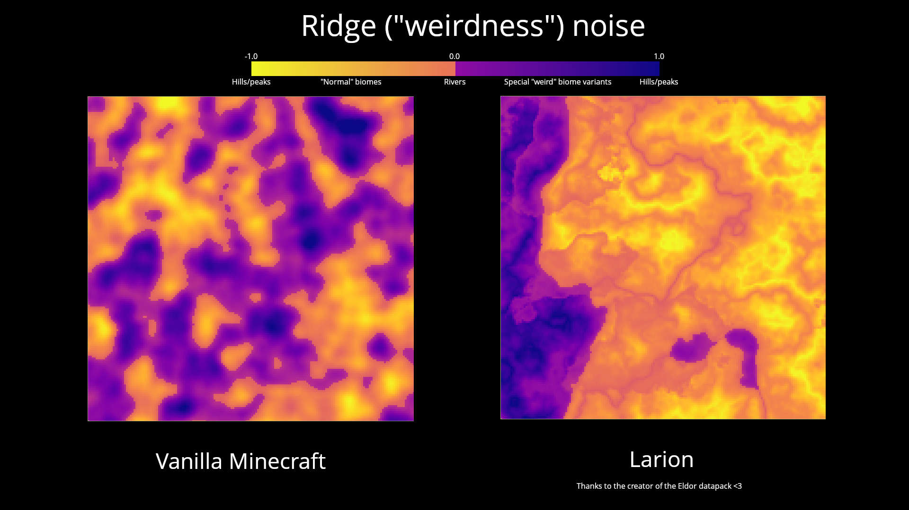

An additional feature is that rivers can now flow underground in tunnels,
meaning they will continue below mountains and hilly terrain! They will also
rarely be obstructed by terrain outside of tunnels, making them much easier to
sail though. This was a must-have feature with all the extra hills, without it
rivers would be blocked all of the time.

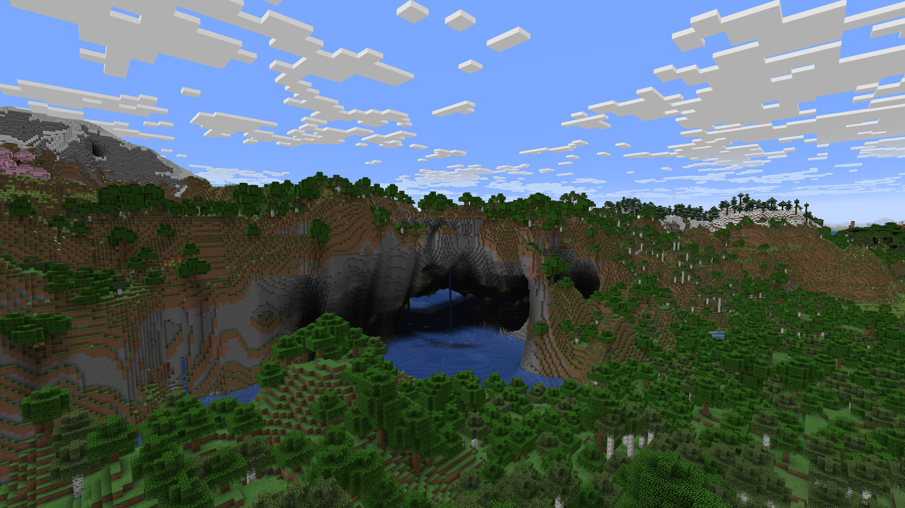

## More vegetation, but sometimes less

The vegetational noise has not been changed too much, but it's a bit more random
(two layers of noise instead of one) and has been tweaked slightly to provoke my
"favorite" biomes of each temperature band to appear. Icy zones are more dry
(less snow-free taigas!), cold zones more humid (old growth pine forests!),
subtropical zones dry (deserts!), tropical zones humid (jungles!).

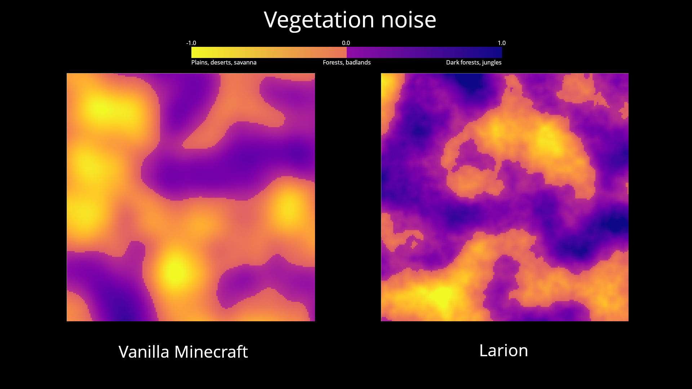

## Desert dunes

All the above changes to erosion and continents meant deserts had become
annoyingly rare and odd-looking. They didn't jive with the jank factor, and they
usually only appeared along coastlines while inland terrain was exclusively
badlands. Because if this I decided to make a special case - in subtropical
temperature bands, a stripe of very high erosion (high erosion + subtropical =
desert) will always appear and no "jank" will be applied. Instead of the jank,
these zones are covered with large dunes.

## Way weirder mushroom islands

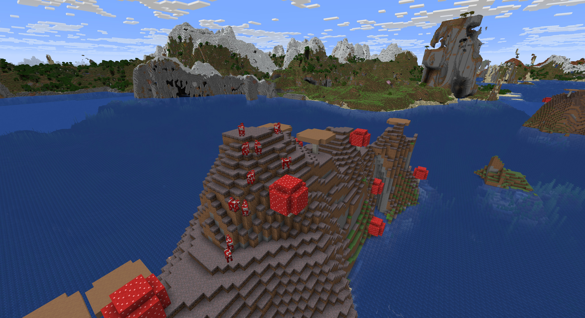

As a side effect of many of the other changes, mushroom islands are somewhat
more common and generate as scattered islands or single small blobs. They are
more hilly than usual with more varied terrain features - sometimes they even float.

The island group pictured here is unusually large!

# Known issues

- Some seeds will spawn you in water or on a tiny island out of nowhere. If you
  want a bit more predictability when creating a world, I would recommend using
  [World Preview](https://modrinth.com/mod/world-preview).
- World generation performance is way worse due to the increased complexity of
density functions and increased world height. The extra "jank" effect that
creates overhangs seems to cause the largest reduction in speed because it adds
two extra layers of full-3d noise to the mix. You can remedy this by using
worldgen optimization mods - I recommend these:
    - [C2ME](https://modrinth.com/mod/c2me-fabric) (MAJOR performance boost, scales with CPU core count)
    - [Noisium](https://modrinth.com/mod/noisium)
    - [Faster Random](https://modrinth.com/mod/faster-random)
    - [FerriteCore](https://modrinth.com/mod/ferrite-core)
- There seems to be some kind of incompability between **More Density
Functions** and **Chunky** - in my experience, Chunky fails to generate any new
chunks, which is unfortunate.. I experienced no such problems with the other
chunk pre-generation methods I tried:
    - [Distant Horizons](https://modrinth.com/mod/distanthorizons) (Only generates LODs, not real chunks)
    - [Fabric/Quilt Chunk Pregenerator](https://modrinth.com/mod/distanthorizons) (Not as featureful as Chunky, but a working alternative for now)

# Note on datapack compability

Larion overwrites a lot of world generation data files. Unfortunately this can
cause compability issues with several other datapacks that change the same
files.

Note that Larion does NOT change any of the biome files, so mods that only
modify biomes (such as Arboria and Geophilic) should be fully compatible!

[William Wyther's Overhauled Overworld](https://modrinth.com/mod/wwoo) is also
fully compatible (and heavily recommended!!) as long as you delete
`data/minecraft/dimension_type/overworld.json` from its .zip/.jar archive -
otherwise tall mountains will be cut off at Y=320. I have no idea why WWOO
overwrites this file, it seems no actual changes were made..

## Changes to vanilla data files

To make it easier to create compability patches etc, here is a list of
overwritten files along with descriptions what has been changed.

- `dimension_type/overworld.json` and `dimension_type/overworld_caves.json`
    - Changed `height` and `logical_height` to 512
- `worldgen/noise_settings/overworld.json`
    - Changed `noise/height` to 512
    - Two changes inside the giant `final_density` function
        - Modified the `y_clamped_gradient` that previously limited mountain height
          to 240-256 to be at 420-447 instead
        - Inject the `larion:overworld/river_noodle` density function inside/near `blend_density`
    - Changed `fluid_level_floodedness` and `fluid_level_spread` using `larion:overworld/river_noodle_flood` to make sure river caves are always "flooded" (full of water at sea level)
    - Changed `temperature` and `vegetation` to point at my own density
    functions instead of just being simple noises
- Six density functions in `overworld` have been overwritten
    - `continents`, `erosion` and `ridges` have all been rewired to point at
    density functions in the `larion` scope
    - `depth` is edited to increase max terrain height to 448 (from 320)
    - `offset` has been modified to make sure the sea level aligns correctly
    (The weirdly specific `-0.7437500262260437` number) and also to add
    `larion:overworld/dunes` to terrain height
    - `sloped_cheese` has been modified to add `larion:overworld/minecraftness`
    to overall terrain density, creating overhangs and weirdness

# Footnote

Larion is licensed under Apache 2.0, meaning you are free to modify and use the
pack as you wish. You can freely use any individual parts in your own
datapack. However, if you choose to redistribute Larion, please be sure to
include the copyright (LICENSE.md) file, a link to this page and also state any
significant changes made to the datapack.

The current version took about a month of precious free time to make.
If you like the project and want to send me a donation, here is a Paypal link:

https://www.paypal.com/donate/?hosted_button_id=L2WKHTDJ4DANU

.. or perhaps send some Bitcoin: bc1qk5688pjsy228zkrda5e9w43wzn0zye4w0ygej4

Thank you for reading <3
